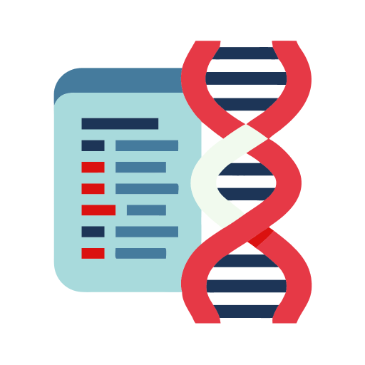

  

## [0.9-BETA] - 2025-07-07

### Major Changes

- **Community Filtering Overhaul:**

  - Dynamic, per-test community selection with checkboxes
  - More accurate filtering and skipping of non-matching communities
  - UI now shows available communities for each DNA kit

- **CSV Export Enhancements:**

  - Communities column added to CSV output
  - Dynamic region columns: new regions auto-added as needed
  - Improved duplicate prevention and data integrity

---
