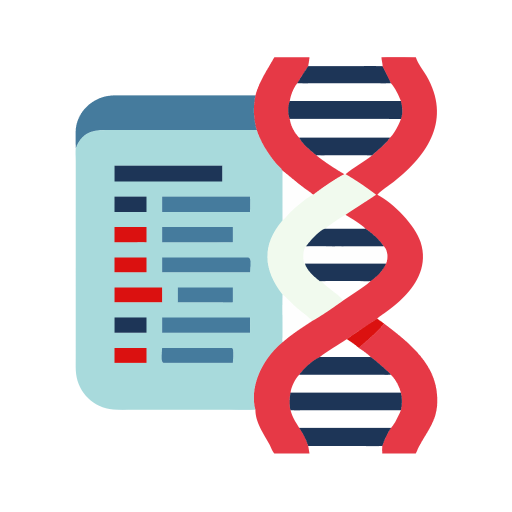

<div align="center">
  
</div>

# MatchScope – AncestryDNA Edition

**Version:** 0.5-BETA

A modern desktop app (built with Flet) for extracting, analyzing, and visualizing your AncestryDNA matches—including detailed ethnicity region breakdowns for each match. MatchScope features a responsive UI, real-time progress, robust CSV export, ethnicity bar charts, pause/resume controls, support for multiple test kits, and safe, local-only data handling.

## ⚠️ Beta Software Notice

This is beta software with a technical authentication method. Users must manually extract their browser cookies from the Network tab of their logged-in Ancestry.com session and paste them into the app.

## Features

- **Comprehensive Match Retrieval**: Extract DNA match data including names, sample IDs, and shared centimorgans
- **Advanced Custom Filtering**: Specify custom centimorgan (cM) ranges and filter matches with greater flexibility.
- **Ethnicity Bar Charts**: Visualize ethnicity regions for each match in real time
- **Smart CSV Export**: Progressive saving with automatic column management
- **Pause/Resume**: Control processing at any time
- **Multiple Test Support**: Analyze multiple DNA kits per account
- **Live Progress**: Real-time status and progress bar

## Requirements

- Python 3.8+
- `requests` library
- `flet` library
- Active AncestryDNA account with matches

## Installation

1. Clone or download this repository
2. Install required dependencies:
   ```bash
   pip install -r requirements.txt
   ```
3. Run the application:
   ```bash
   python matchscope.py
   ```

## How to Use

### Step 1: Authentication Setup

1. Log into your AncestryDNA account in a web browser
2. Go to the **Matches** section of Ancestry.com: https://www.ancestry.com/discoveryui-matches/
3. Open browser Developer Tools (F12)
4. Go to the **Network** tab
5. Refresh the page
6. Click any request in the list that shows a `cookie` header in the Headers section
7. In the **Headers** section, find the `cookie` header and copy its entire value
8. Paste the cookie string into the MatchScope app's cookie box

### Step 2: Data Retrieval

1. Click "Authenticate" to verify your session
2. Select which DNA test to analyze (if you have multiple)
3. Set how many matches to retrieve (default: 50)
4. Click "Get Matches" to start the retrieval process

### Step 3: Monitor Progress

- Watch real-time status and progress bar in the application
- Use Pause/Resume to control the process (buttons appear only during processing)
- View ethnicity region bar charts for each match as they're processed
- Data is progressively saved to a timestamped CSV during retrieval

## Output Format

The tool generates CSV files with the following structure (columns may vary depending on ethnicity regions found):

| Display Name | Sample ID | sharedCM | England & Northwestern Europe | Ireland | Scotland | ... |
| ------------ | --------- | -------- | ----------------------------- | ------- | -------- | --- |
| John Doe     | 12345     | 45.2     | 25.5                          | 15.3    | 8.7      | ... |

- **Display Name**: The match's display name
- **Sample ID**: Unique identifier for the DNA sample
- **sharedCM**: Amount of shared DNA in centimorgans
- **Region Columns**: Percentage of DNA from each ethnic region (100+ regions supported)

## File Naming

CSV files are automatically named using the pattern:

```
matches_{test_guid}_{YYYYMMDD}.csv
```

Example: `matches_ABC123_20250704.csv`

## Technical Details

### Rate Limiting & Threading

- 2.5-second delay between API requests to respect Ancestry's servers
- Pause/resume functionality for long-running operations
- All UI updates are performed safely from the background thread

### Data Integrity

- CSV handling adapts to changing column structures (new regions auto-added)
- Duplicate detection prevents redundant data

## Troubleshooting

### Authentication Issues

- Ensure you're logged into AncestryDNA in your browser
- Make sure you copied the entire cookie string from the Network tab's `cookie` header (from the Matches section)
- Try refreshing the Matches page and copying the cookie string again

### No Matches Retrieved

- Check that you have DNA matches on your account
- Verify the selected test has matches available

### Application Crashes

- Check that all required Python packages are installed
- Verify you're using Python 3.8 or later
- Check the console output for specific error messages

## Privacy and Security

- **No Data Storage**: The application doesn't store your login credentials
- **Local Processing**: All data processing happens on your computer
- **Session-Based**: Uses temporary browser session data only
- **Export Control**: You control what data is exported and where

## Future Development

Planned features for future releases:

- Enhanced progress persistence for interruption recovery
- Leeds Method support
- Additional advanced filtering and search capabilities
- More export formats and reporting options

## Contributing

This is a beta release. Bug reports and feature requests are welcome!

## Disclaimer

This tool is for personal use with your own AncestryDNA data. Users are responsible for complying with Ancestry's Terms of Service. The tool respects rate limits and follows best practices for API usage.

## License

GNU General Public License v3.0 (GPL-3.0)

Copyright (C) 2025 Omar Nunez

This program is free software: you can redistribute it and/or modify
it under the terms of the GNU General Public License as published by
the Free Software Foundation, either version 3 of the License, or
(at your option) any later version.

This program is distributed in the hope that it will be useful,
but WITHOUT ANY WARRANTY; without even the implied warranty of
MERCHANTABILITY or FITNESS FOR A PARTICULAR PURPOSE. See the
GNU General Public License for more details.

You should have received a copy of the GNU General Public License
along with this program. If not, see <https://www.gnu.org/licenses/>.

**Commercial Licensing:** For commercial use or proprietary applications,
please contact Omar Nunez for alternative licensing arrangements.
